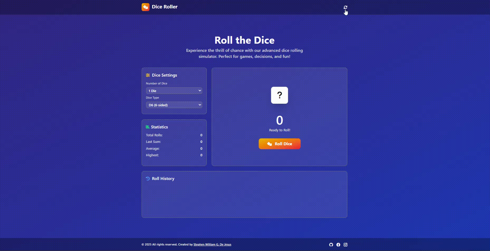
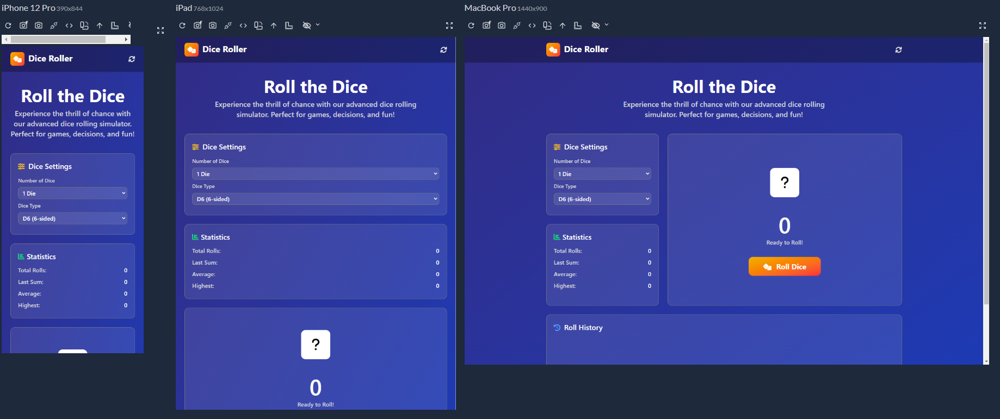

# 🎲 Dice Roller – Interactive Dice Simulator
A comprehensive virtual dice rolling application built with **HTML**, **Tailwind CSS**, and **JavaScript**.  
Roll D4 and D6 dice with multiple dice support, rolling animations, and detailed statistics tracking!

Crafted by **[Stephen William G. De Jesus](https://www.facebook.com/stephenwilliam.dejesus.5/)**, this project showcases interactive animations, accessibility features, and advanced JavaScript functionality.

---

## 📸 Preview  
### 🎞️ Live Interaction (GIF)  

### 🖼️ Application Screenshot  
 

---

## 🌐 Live Demo  
[View Live Demo](https://bogiiiie.github.io/12-javascript-dice-roller/) 
---

## ✨ Features
- 🎲 **Multiple Dice Types** – D4 (4-sided) and D6 (6-sided) dice support
- 🎯 **Variable Dice Count** – Roll 1-5 dice simultaneously
- 🎪 **Rolling Animations** – Engaging spin animations during rolls
- 📊 **Live Statistics** – Total rolls, last sum, average, and highest score
- 📝 **Roll History** – Complete history of all previous rolls
- 🎨 **Visual Dice Display** – Realistic dice images with results
- ⚡ **Instant Results** – Real-time sum calculation and individual values
- 🔄 **Game Reset** – Clear all data and start fresh
- 📱 **Responsive Design** – Optimized for all screen sizes
- ♿ **Accessibility Ready** – Full screen reader support
- 🎨 **Modern UI** – Gradient backgrounds and smooth transitions

---

## 🎮 How to Use
1. **Configure Dice** – Select number of dice (1-5) and type (D4/D6)
2. **Roll Dice** – Click the "Roll Dice" button to generate random results
3. **View Results** – See individual dice values and total sum
4. **Track Statistics** – Monitor your rolling performance metrics
5. **Check History** – Review all previous rolls in the history panel
6. **Reset Game** – Use the restart button to clear all data

---

## 🎲 Dice Types & Mechanics
```
D4 (4-sided): Values 1-4
D6 (6-sided): Values 1-6
Maximum Dice: 5 per roll
Rolling Animation: 1-second spin effect
```

---

## 📊 Statistics Tracked
- **Total Rolls** – Number of dice roll sessions completed
- **Last Sum** – Sum of the most recent dice roll
- **Average** – Mean value of current roll
- **Highest** – Highest sum achieved in current session

---

## 🛠️ Built With
- [HTML5](https://developer.mozilla.org/en-US/docs/Web/Guide/HTML/HTML5) – Semantic structure and accessibility
- [Tailwind CSS](https://tailwindcss.com/) – Utility-first responsive styling
- [JavaScript ES6+](https://developer.mozilla.org/en-US/docs/Web/JavaScript) – Dice logic and animations
- [Font Awesome](https://fontawesome.com/) – Icons and visual elements
- [Bootstrap Icons](https://icons.getbootstrap.com/) – Additional UI icons

---

## 📁 Project Structure
```
12-javascript-dice-roller/
├── index.html          # Main HTML structure
├── script.js           # JavaScript functionality  
├── output.css          # Compiled Tailwind CSS
└── images/
    ├── Dice-1.png      # Dice face images
    ├── Dice-2.png
    ├── Dice-3.png
    ├── Dice-4.png
    ├── Dice-5.png
    └── Dice-6.png
```

---

## 🚀 Getting Started
To run this project locally:

```bash
git clone https://github.com/bogiiiie/12-javascript-dice-roller.git
cd 12-javascript-dice-roller
open index.html
```

No build process required – just open `index.html` in your browser!

---

## 🎯 Key Functions
- **`rollDice(diceCount, diceType)`** – Generates random dice values
- **`randomDiceDigit(diceType)`** – Returns random number for dice type
- **`rollingDiceProcess()`** – Handles rolling animation sequence
- **`displayStatistics(diceArray)`** – Updates all statistics displays
- **`digitizedDice(currentRollSet)`** – Updates dice visual display
- **`displayHistoryListItem()`** – Adds roll to history log
- **`sumOfDice(diceArray)`** – Calculates total sum of dice
- **`resetStatistics()`** – Clears all statistical data

---

## ♿ Accessibility Features
- 🏷️ **Semantic HTML** – Proper ARIA labels and roles
- 📢 **Screen Reader Support** – Descriptive text for all interactions
- ⌨️ **Keyboard Navigation** – Full keyboard accessibility
- 🎯 **Focus Management** – Clear focus indicators
- 📱 **Responsive Design** – Works with screen magnification
- 🔊 **Live Regions** – Dynamic content announcements
- 📝 **Alternative Text** – Image descriptions for dice faces

---

## 📱 Responsive Layout
- **Desktop** – Grid layout with side panels and central dice area
- **Tablet** – Optimized spacing with touch-friendly controls
- **Mobile** – Stacked vertical layout for easy interaction

---

## 🎨 UI/UX Features
- **Gradient Backgrounds** – Beautiful indigo-to-blue gradients
- **Smooth Animations** – CSS transitions and JavaScript animations
- **Visual Feedback** – Spinning dice and button state changes
- **Color Coding** – Consistent color scheme throughout
- **Loading States** – "Rolling..." indicator during animations
- **Interactive Elements** – Hover effects and active states

---

## 🔗 Connect with Me
- 💻 **GitHub**: [@bogiiiie](https://github.com/bogiiiie)
- 📘 **Facebook**: [Stephen William De Jesus](https://www.facebook.com/stephenwilliam.dejesus.5/)
- 📷 **Instagram**: [@stephenwilliamdejesus](https://www.instagram.com/stephenwilliamdejesus/)

---

## 👨‍💻 Author
Created by **[Stephen William G. De Jesus](https://www.facebook.com/stephenwilliam.dejesus.5/)**

---

## 📄 License
© 2025 All rights reserved. Created by Stephen William G. De Jesus.

---

## 🚀 Future Enhancements
- 🎲 **More Dice Types** – D8, D10, D12, D20 support
- 📈 **Advanced Statistics** – Charts and probability analysis
- 🎵 **Sound Effects** – Audio feedback for dice rolls
- 🌙 **Dark/Light Mode** – Theme switching capability
- 💾 **Save Sessions** – Persist data between visits
- 🏆 **Achievements** – Unlock rewards for milestones
- 🎯 **Dice Presets** – Save common dice configurations
- 📱 **PWA Support** – Install as mobile app
- 🎨 **Custom Themes** – User-selectable color schemes
- 🔄 **Auto-Roll Mode** – Continuous rolling feature
